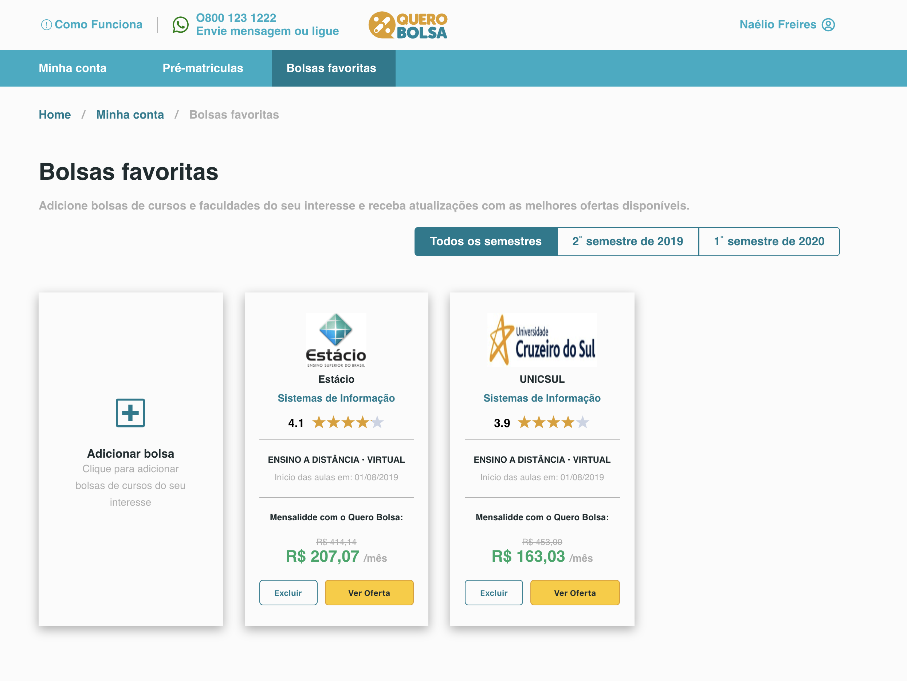

# Desafio Quero Educação - Front End

## Descrição
  - Pequena aplicação desenvolvida com React JS
## Imagens da aplicação

## Executar

- git clone https://github.com/naeliofreires/FrontTestQueroEducacao.git

- cd FrontTestQueroEducacao

- yarn

- yarn start

- acesse http://localhost:3000/
